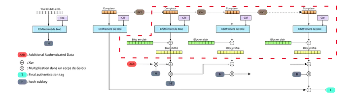

# Cryptography & PKI
This repository is the the work of Patrick L. to advance his skills in cryptography thanks to crytopals and cryptohack.

You can read some write-ups about it on his [blog medium](https://medium.com/@patrickl.publique) :
 - [Attacks against ellitpic curves, from ECDH to ECDSA](https://medium.com/@patrickl.publique/attacks-on-elliptic-curves-pollard-polhig-invalid-curve-twist-lattice-18ac1abfb6c8)
 - [AES-GCM implementation and attacks](https://medium.com/@patrickl.publique/aes-gcm-nonce-reuse-attack-515f7acec3f7)

